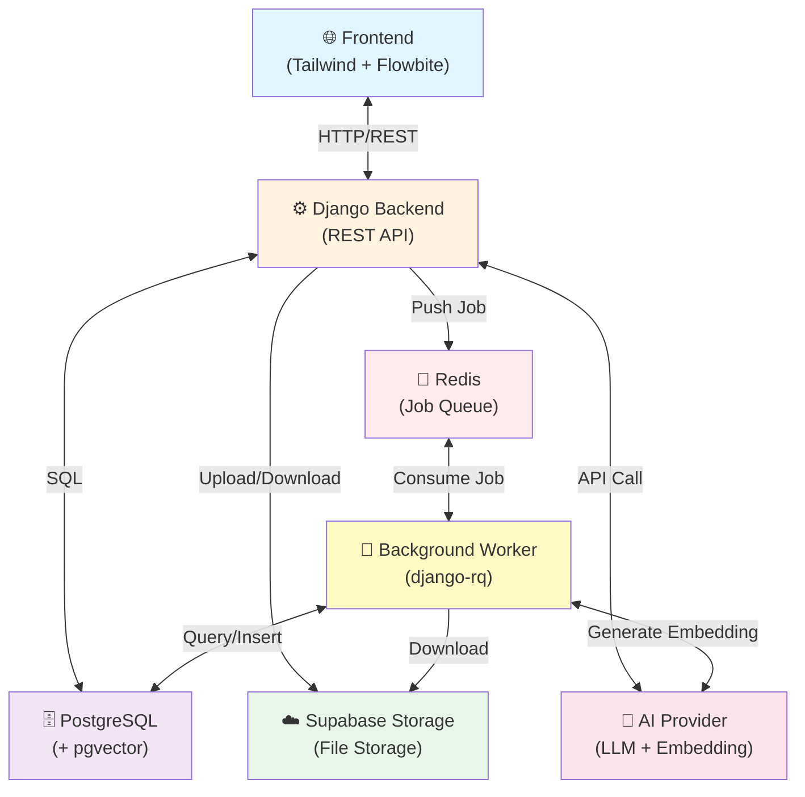
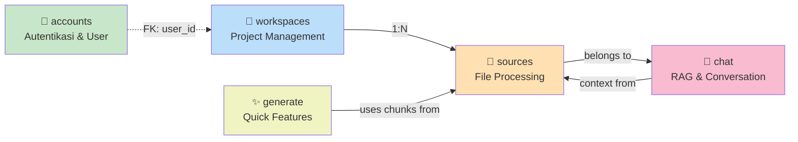
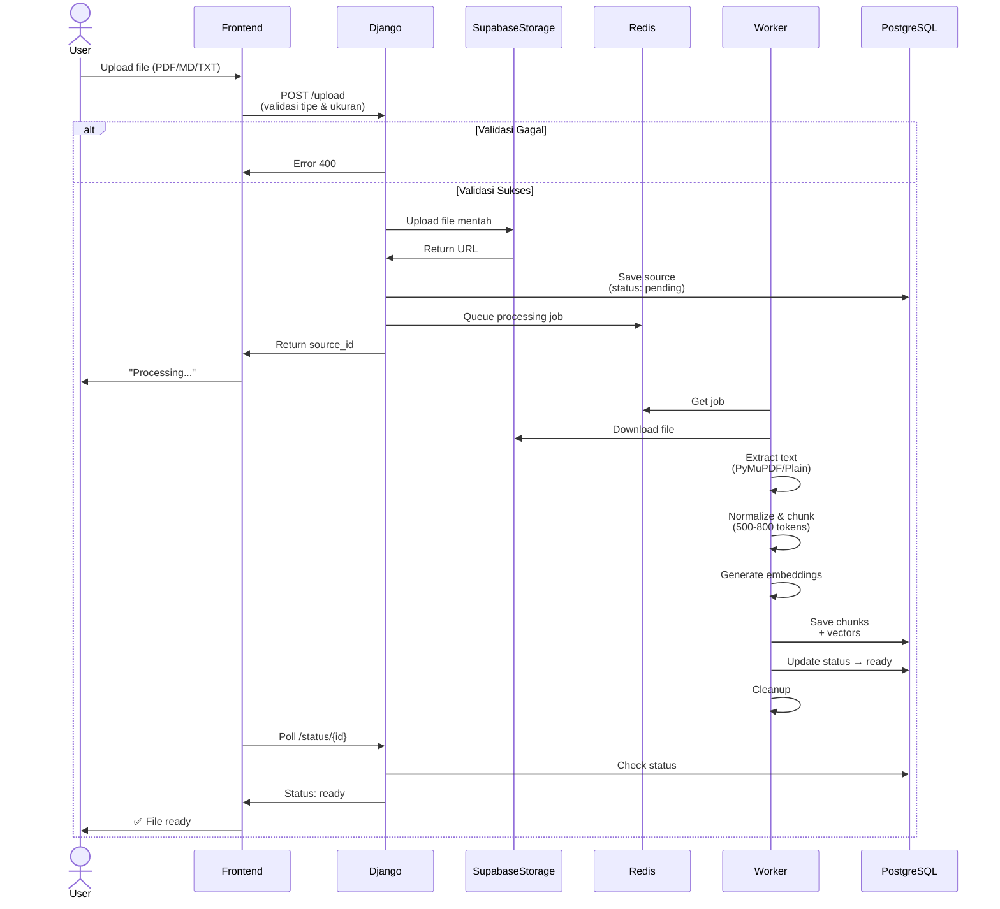
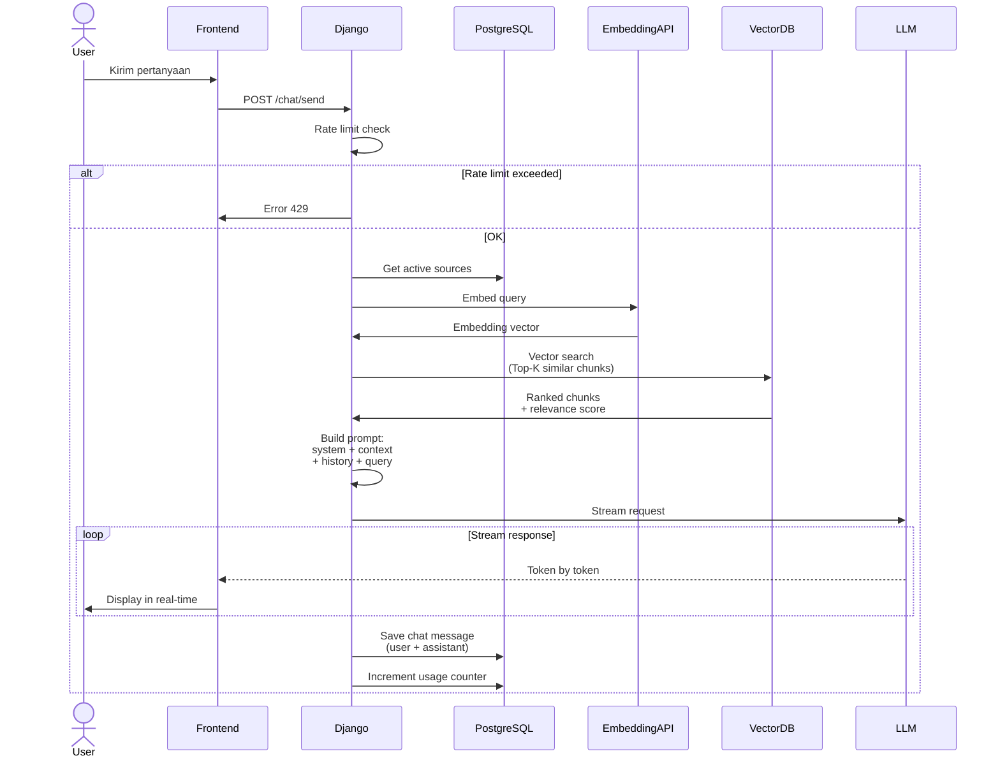
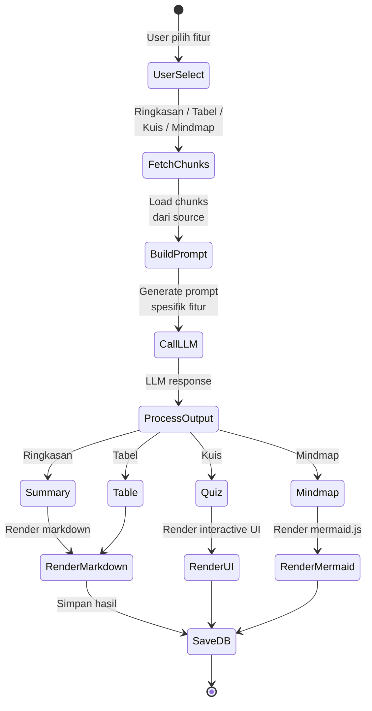
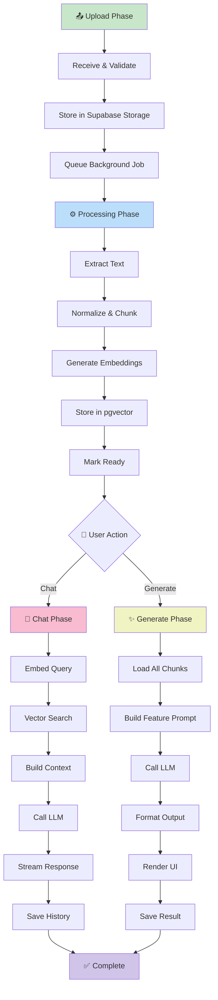

# Dokumentasi Arsitektur Sistem — MythosNote

## Ringkasan Eksekutif

Proyek ini adalah sistem AI-powered note-taking yang memungkinkan pengguna mengelola workspace, mengunggah dokumen, dan berinteraksi dengan AI berdasarkan konteks dokumen. Arsitektur dirancang dengan prinsip **separation of concerns** pisahkan storage, processing, dan retrieval untuk skalabilitas dan maintainability yang optimal.

---

## 📌 Daftar Isi

1. [Gambaran Umum](#1-gambaran-umum)
2. [Tech Stack & Justifikasi](#2-tech-stack--justifikasi)
3. [Struktur Aplikasi](#3-struktur-aplikasi)
4. [Alur Sistem Utama](#4-alur-sistem-utama)
5. [Database Schema](#5-database-schema)
6. [Fitur & Spesifikasi](#6-fitur--spesifikasi)
7. [Batasan & Rate Limiting](#7-batasan--rate-limiting)
8. [Struktur Folder Django](#8-struktur-folder-django)
9. [Deployment](#9-deployment)
10. [Saran Tambahan](#10-saran-tambahan)

---

## 1. Gambaran Umum

Aplikasi ini adalah versi sederhana dari **NoteBookLLM** pengguna bisa membuat workspace, upload dokumen, lalu berinteraksi dengan AI berdasarkan konteks dokumen tersebut.

### Diagram Arsitektur Sistem



---

## 2. Tech Stack & Justifikasi

### Stack Utama

| Layer | Teknologi | Alasan |
|---|---|---|
| Backend | **Django 5.x** | Mature, batteries-included |
| Frontend | **Tailwind CSS + Flowbite** | Ringan, tidak butuh build step kompleks |
| Database | **PostgreSQL** | Relational yang solid, support JSON field |
| File Storage | **Supabase Storage** | Murah, andal, mudah diintegrasikan |
| Queue | **Redis + django-rq** | Lebih simpel dari Celery |
| Deployment | **Railway** | Lebih mudah dari Heroku, support Redis + Postgres gratis |

### Saran Tech Stack Tambahan

| Kebutuhan | Saran | Alasan |
|---|---|---|
| **LLM** | Google Gemini API (gemini-2.0-flash), DeepSeek API (deepseek-chat) | Murah, konteks panjang, ada free tier / cost-effective |
| **Embedding** | `text-embedding-3-small` (OpenAI) atau Gemini Embedding | Murah, performa baik |
| **Vector Search** | **pgvector** (PostgreSQL extension) | ⭐ Tidak perlu infra tambahan |
| **PDF Parsing** | `PyMuPDF` (fitz) | Cepat dan akurat |
| **Markdown Render** | `marked.js` (frontend) | Ringan, CDN |
| **Mermaid Render** | `mermaid.js` (frontend) | Untuk fitur mindmap |

> **Kenapa pgvector, bukan Chroma/FAISS?**
> Karena sudah pakai PostgreSQL. Tambah extension pgvector = vector search tanpa infra baru. ini lebih dari cukup.

---

## 3. Struktur Aplikasi

### Organisasi Django Apps

Arsitektur aplikasi mengikuti **modular design pattern** dengan tanggung jawab yang jelas untuk setiap modul:



**Responsibilitas Setiap App:**
- **accounts** — User registration, authentication, profile management
- **workspaces** — CRUD workspace, multi-project support
- **sources** — File upload, text extraction, chunking, embedding generation
- **chat** — Chat session management, RAG retrieval, conversation history
- **generate** — Quick features (summary, table, quiz, mindmap)

---

## 4. Alur Sistem Utama

### 4.1 Alur Upload & Processing File



### 4.2 Alur Chat dengan AI (RAG Pipeline)



### 4.3 Alur Quick Generate Features



---

## 5. Database Schema

### Tabel Utama

```sql
-- User (built-in Django auth)
users (id, email, username, created_at)

-- Workspace / Project
workspaces (
  id          UUID PRIMARY KEY,
  user_id     FK → users,
  name        VARCHAR(255),
  description TEXT,
  created_at  TIMESTAMP
)

-- Source (file yang diupload)
sources (
  id          UUID PRIMARY KEY,
  workspace_id FK → workspaces,
  filename    VARCHAR(255),
  file_type   VARCHAR(10),    -- "pdf", "md", "txt"
  file_size   INTEGER,        -- bytes
  storage_url TEXT,           -- URL ke Supabase Storage
  status      VARCHAR(20),    -- "pending", "processing", "ready", "failed"
  created_at  TIMESTAMP
)

-- Chunk (hasil pemecahan teks)
chunks (
  id          UUID PRIMARY KEY,
  source_id   FK → sources,
  content     TEXT,           -- isi chunk
  chunk_index INTEGER,        -- urutan chunk
  embedding   VECTOR(1536),   -- pgvector (sesuaikan dimensi model)
  token_count INTEGER
)

-- Chat Session
chat_sessions (
  id          UUID PRIMARY KEY,
  workspace_id FK → workspaces,
  title       VARCHAR(255),
  created_at  TIMESTAMP
)

-- Chat Message
chat_messages (
  id          UUID PRIMARY KEY,
  session_id  FK → chat_sessions,
  role        VARCHAR(10),    -- "user" / "assistant"
  content     TEXT,
  created_at  TIMESTAMP
)

-- Generate Result
generate_results (
  id          UUID PRIMARY KEY,
  workspace_id FK → workspaces,
  feature     VARCHAR(20),    -- "summary", "table", "quiz", "mindmap"
  options     JSONB,          -- misal: {count: "medium", difficulty: "easy"}
  result      TEXT,           -- output (markdown / JSON / mermaid code)
  created_at  TIMESTAMP
)

-- Rate Limit Tracker
user_usage (
  id          UUID PRIMARY KEY,
  user_id     FK → users,
  date        DATE,
  prompt_count INTEGER DEFAULT 0
)
```

---

## 6. Fitur & Spesifikasi

### 6.1 Workspace

- User bisa membuat banyak workspace
- Setiap workspace punya nama dan deskripsi opsional
- Workspace berisi kumpulan source dan riwayat chat

### 6.2 Upload Source

| Aspek | Detail |
|---|---|
| Format yang didukung | `.pdf`, `.md`, `.txt` |
| Ukuran maksimal | 10 MB per file |
| Jumlah file per workspace | Maks 20 file (saran) |
| Processing | Async via background worker |
| Status tracking | pending → processing → ready / failed |

### 6.3 Chat dengan AI

- Pilih source mana saja yang menjadi konteks
- Riwayat chat tersimpan per sesi
- Context injection otomatis dari chunk relevan (RAG)
- Streaming response dari AI

### 6.4 Quick Generate

#### Ringkasan
- Generate ringkasan naratif dari source yang dipilih
- Output: teks markdown

#### Tabel Data
- Ekstrak data terstruktur dari source
- Output: markdown table

#### Kuis (Pilihan Ganda)

| Opsi | Pilihan |
|---|---|
| Jumlah soal | Sedikit (5) / Menengah (10) / Banyak (20) |
| Kesulitan | Mudah / Menengah / Sulit |
| Default (tanpa pilih) | 10 soal, kesulitan menengah |

Output format (JSON internal):
```json
{
  "questions": [
    {
      "question": "...",
      "options": ["A. ...", "B. ...", "C. ...", "D. ..."],
      "answer": "A",
      "explanation": "..."
    }
  ]
}
```

#### Mindmap
- Generate struktur mindmap dari source
- AI output: kode Mermaid.js
- Frontend: render via `mermaid.js`

Contoh output AI:
```
mindmap
  root((Topik Utama))
    Subtopik A
      Poin 1
      Poin 2
    Subtopik B
      Poin 3
```

---

## 7. Batasan & Rate Limiting

### Batasan File
```python
ALLOWED_FILE_TYPES = ["application/pdf", "text/markdown", "text/plain"]
MAX_FILE_SIZE_MB   = 10
MAX_FILES_PER_WORKSPACE = 20
```

### Batasan Penggunaan AI
```python
MAX_PROMPTS_PER_DAY = 50   # bisa disesuaikan
MAX_GENERATES_PER_DAY = 20
```

### Implementasi Rate Limit
Gunakan tabel `user_usage` di database. Cek dan increment setiap kali user kirim prompt. Reset setiap hari (berdasarkan kolom `date`).

> Tidak perlu library eksternal untuk skala kecil. Cukup query sederhana ke DB.

---

## 8. Struktur Folder Proyek Django

```
myproject/
│
├── 📄 Konfigurasi Root
│   ├── manage.py
│   ├── requirements.txt
│   ├── .env
│   ├── .gitignore
│   └── Procfile
│
├── 🔧 config/              (Django Configuration)
│   ├── settings/
│   │   ├── base.py         (Base settings)
│   │   ├── development.py  (Dev overrides)
│   │   └── production.py   (Production overrides)
│   ├── urls.py             (URL routing)
│   └── wsgi.py             (WSGI entry)
│
├── 📦 apps/                (Business Logic)
│   │
│   ├── 👤 accounts/
│   │   ├── models.py       (Custom user model)
│   │   ├── views.py        (Auth views)
│   │   ├── forms.py        (Auth forms)
│   │   └── urls.py
│   │
│   ├── 📁 workspaces/
│   │   ├── models.py       (Workspace model)
│   │   ├── views.py        (CRUD views)
│   │   ├── serializers.py  (API serializers)
│   │   └── urls.py
│   │
│   ├── 📄 sources/         (File Processing)
│   │   ├── models.py       (Source, Chunk models)
│   │   ├── views.py        (Upload views)
│   │   ├── tasks.py        (RQ background jobs)
│   │   ├── processors.py   (Text extraction & chunking)
│   │   ├── embeddings.py   (Embedding generation)
│   │   ├── serializers.py
│   │   └── urls.py
│   │
│   ├── 💬 chat/            (Conversation & RAG)
│   │   ├── models.py       (ChatSession, Message)
│   │   ├── views.py        (Chat endpoints)
│   │   ├── retrieval.py    (Vector search logic)
│   │   ├── serializers.py
│   │   └── urls.py
│   │
│   └── ✨ generate/        (Quick Features)
│       ├── views.py        (Generate endpoints)
│       ├── prompts.py      (LLM prompts per feature)
│       ├── processors.py   (Output processing)
│       └── urls.py
│
├── 🎨 templates/           (HTML Templates)
│   ├── base.html
│   ├── auth/
│   ├── workspaces/
│   ├── sources/
│   ├── chat/
│   └── generate/
│
└── 📦 static/              (Frontend Assets)
    ├── css/
    │   ├── tailwind.css
    │   └── custom.css
    └── js/
        ├── mermaid.min.js
        ├── marked.min.js
```

---

## 9. Deployment

### Railway (Rekomendasi)

Railway memudahkan karena bisa deploy Django, PostgreSQL, dan Redis dalam satu platform.

```
Railway Project
├── Django App (Web Service)
│   - Buildpack otomatis
│   - Environment variables dari Railway
├── PostgreSQL (Plugin)
│   - Aktifkan pgvector extension
└── Redis (Plugin)
    - Untuk job queue (RQ)
```

### Environment Variables yang Diperlukan

```env
SECRET_KEY=...
DEBUG=False
DATABASE_URL=...           # otomatis dari Railway
REDIS_URL=...              # otomatis dari Railway
SUPABASE_URL=...
SUPABASE_KEY=...
SUPABASE_BUCKET=...
AI_API_KEY=...             # Gemini / OpenAI / DeepSeek
DEEPSEEK_API_KEY=...       # DeepSeek API Key
DEEPSEEK_BASE_URL=...      # DeepSeek base URL (OpenAI-compatible)
ALLOWED_HOSTS=yourdomain.railway.app
```

### Procfile

```
web: gunicorn config.wsgi:application
worker: python manage.py rqworker default
```

> Jalankan dua proses: satu web server, satu worker untuk background job.

---

## 10. Saran Tambahan

### Yang Harus Diprioritaskan (Core)
1. ✅ Upload & processing file (async)
2. ✅ Embedding + pgvector
3. ✅ Chat dengan RAG
4. ✅ Quick Generate (minimal 2 fitur dulu)

### Yang Bisa Ditambah Jika Waktu Cukup
- [ ] Notifikasi real-time saat file selesai diproses (polling sederhana dulu, bukan WebSocket)
- [ ] Preview source di sidebar
- [ ] Export hasil generate (download markdown/PDF)
- [ ] Rename / hapus workspace dan source

### Yang Sebaiknya Tidak Dilakukan
- ❌ Jangan pakai Celery — terlalu kompleks untuk skala ini, RQ cukup
- ❌ Jangan pakai Chroma/Weaviate — pgvector sudah cukup
- ❌ Jangan buat REST API penuh jika tidak butuh — Django views + HTMX lebih cepat dikerjakan
- ❌ Jangan over-index fitur — selesaikan core dulu

---

## 10. Alur Sistem End-to-End



### Prinsip Desain Arsitektur

1. **Separation of Concerns** — Setiap komponen punya tanggung jawab spesifik
2. **Asynchronous Processing** — File processing tidak memblokir user experience
3. **Vector-First Retrieval** — Menggunakan semantic search untuk konteks berkualitas tinggi
4. **Scalable Storage** — Supabase Storage untuk files, PostgreSQL untuk metadata + vectors
5. **Simple Job Queue** — RQ cukup 

Arsitektur ini dirancang untuk:
- ✅ Mudah diimplementasikan dan di-debug
- ✅ Scalable tanpa overengineering
- ✅ Cost-effective dengan infrastructure minimal
- ✅ Maintainable dengan struktur code yang jelas

---