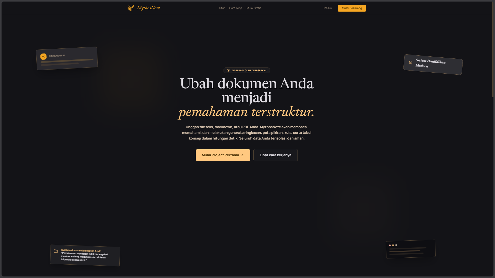

# MythosNote

Sistem AI-powered note-taking yang memungkinkan pengguna mengelola workspace, mengunggah dokumen, dan berinteraksi dengan AI berdasarkan konteks dokumen.

<p align="center">
  
  
  
  
  
  
  
  
</p>



---

## Daftar Isi

- [Fitur Utama](#fitur-utama)
- [Arsitektur Teknis](#arsitektur-teknis)
- [Prasyarat Sistem](#prasyarat-sistem)
- [Setup dengan Docker (Recommended)](#setup-dengan-docker-recommended)
- [Konfigurasi Environment](#konfigurasi-environment)
- [Struktur Project](#struktur-project)
- [API Endpoints](#api-endpoints)

---

## Fitur Utama

- Manajemen Workspace: Kelola multiple workspace (max 10 per user), create/rename/delete
- Upload Dokumen: Support PDF/DOCX/TXT dengan ekstraksi teks otomatis
- AI Chat RAG: Interaksi dengan AI berdasarkan konteks dokumen (Retrieval-Augmented Generation)
- Generate Content: Auto-generate ringkasan, tabel, kuis, mindmap via background jobs
- Semantic Search: Pencarian menggunakan embedding vectors
- Cloud Storage: Penyimpanan file secara lokal di direktori server
- Multi-AI Provider: Support Gemini, DeepSeek, OpenRouter, Groq
- Rate Limiting: Proteksi API dengan quota harian per user
- Background Processing: RQ worker untuk ekstraksi & embedding async

---

## Arsitektur Teknis

MythosNote dibangun dengan arsitektur modern yang didesain untuk skalabilitas dan efisiensi AI Retrieval-Augmented Generation (RAG):

- **Vector Database & RAG Pipeline**: Menggunakan **PostgreSQL + pgvector** untuk menyimpan dan melakukan pencarian dokumen menggunakan **Cosine Similarity**. Pendekatan ini memastikan relevansi konteks yang sangat akurat saat berinteraksi dengan AI.
- **Embedding & Chunking Strategy**: Dokumen yang diunggah akan diekstrak lalu dipecah menjadi **potongan-potongan 800-token (chunks)**. Strategi ini menjaga keutuhan konteks antar kalimat sehingga LLM tidak kehilangan benang merah saat merangkum dokumen panjang.
- **Multi-AI Provider Architecture**: Sistem dibangun secara modular untuk mendukung pergantian provider LLM (Gemini, OpenRouter, Groq, dll.) dan Embedding Model secara dinamis tanpa merusak struktur database.
- **Security & Reliability**: 
  - **Rate Limiting**: Dilengkapi proteksi kuota prompt/generate harian untuk menghindari penyalahgunaan API.
  - **Email Verification**: Autentikasi ketat memastikan hanya pengguna valid yang bisa mengunggah dokumen.
  - **Proxy SSL Handling**: Menggunakan konfigurasi Reverse Proxy yang aman ketika di-deploy di belakang Nginx/Cloudflare.

---

## Prasyarat Sistem

- Docker Engine
- Docker Compose plugin
- Git

---

## Setup dengan Docker (Recommended)

MythosNote sekarang menggunakan Docker untuk mempermudah proses deployment dan development. Anda tidak perlu lagi menginstall Python, PostgreSQL, atau Redis secara manual di host OS. (Catatan: Proses `migrate` dan `collectstatic` sudah berjalan otomatis saat container di-build/start).

### Step 1: Clone Repository
```bash
git clone https://github.com/IbnuSabilGitHub/MythosNote.git
cd MythosNote
```

### Step 2: Konfigurasi Environment
Buat file `.env` berdasarkan template yang disediakan:
```bash
cp .env.example .env
```
Buka file `.env` dan sesuaikan nilainya (API Key, dll). Pastikan variabel `DATABASE_URL` ditaruh menyesuaikan `POSTGRES_USER` di dalamnya.

### Step 3: Jalankan Docker Compose
```bash
docker compose up -d --build
```
Perintah ini akan men-download image, membangun container, dan menjalankan 4 service sekaligus di background:
- db (PostgreSQL dengan pgvector)
- redis (Redis server)
- worker (Python RQ background worker)
- web (Django application server)

### Step 4: Buat Admin
Jalankan perintah ini di dalam container web yang sedang berjalan untuk membuat akun admin (Superuser):
```bash
docker compose exec web python manage.py createsuperuser
```

Aplikasi sekarang dapat diakses di: `http://localhost:8000`

---

## Konfigurasi Environment

### File .env - Penjelasan Detail

```bash
# DJANGO
SECRET_KEY=your-secret-key-change-this-in-production
DEBUG=True
ALLOWED_HOSTS=localhost,127.0.0.1

# DATABASE (Sudah diatur otomatis oleh Docker Compose)
POSTGRES_DB=mythosnote
POSTGRES_USER=mythosnote_user
POSTGRES_PASSWORD=your_secure_password
DATABASE_URL=postgresql://${POSTGRES_USER}:${POSTGRES_PASSWORD}@db:5432/${POSTGRES_DB}

# REDIS (Sudah diatur otomatis oleh Docker Compose)
REDIS_URL=redis://redis:6379/0

# EMAIL
EMAIL_MODE=console
DEFAULT_FROM_EMAIL=no-reply@mythosnote.local

# AI PROVIDER
AI_PROVIDER=openrouter
OPENROUTER_API_KEY=your-openrouter-key

# EMBEDDING
EMBEDDING_PROVIDER=openrouter
EMBEDDING_MODEL=openai/text-embedding-3-small
EMBEDDING_DIMENSIONS=1536
```

---

## Struktur Project

```
MythosNote/
├── docker-compose.yml        # Konfigurasi container orchestration
├── Dockerfile                # Konfigurasi image aplikasi
├── requirements.txt          # Python dependencies
├── .env.example              # Environment template
├── README.md                 # Dokumentasi (ini)
│
├── config/                   # Main Django project (sebelumnya mythosnote/)
│   ├── settings.py
│   ├── urls.py
│   └── wsgi.py
│
├── apps/
│   ├── accounts/             # Authentication & user management
│   ├── workspaces/           # Workspace management
│   ├── sources/              # Document/source handling
│   ├── generate/             # AI Generation features
│   └── chat/                 # AI Chat interaction
│
├── static/                   # Static files (CSS, JS)
└── templates/                # HTML templates
```

---

## API Endpoints

### Workspace Management
- GET `/api/workspaces/` - List all workspaces (per user)
- POST `/api/workspaces/` - Create new workspace
- GET `/api/workspaces/{id}/` - Workspace detail
- PUT `/api/workspaces/{id}/rename/` - Rename workspace
- DELETE `/api/workspaces/{id}/` - Delete workspace

### Sources (Dokumen)
- GET `/api/sources/` - List sources per workspace
- POST `/api/workspace/{id}/upload/` - Upload file source ke workspace tertentu
- GET `/api/sources/{id}/status/` - Check processing status dokumen
- DELETE `/api/sources/{id}/` - Delete source & file

### AI Generation & Quota
- GET `/api/quota/` - Monitor sisa kuota (prompt, generate, upload)
- POST `/api/workspace/{id}/generate/` - Request AI content generation (ringkasan/kuis/mindmap)
- GET `/api/generate/{id}/` - Polling status proses generate content (background task)

### AI Chat (RAG-based)
- POST `/api/workspaces/{id}/chat/` - Chat dengan AI berdasarkan konteks dokumen yang aktif
