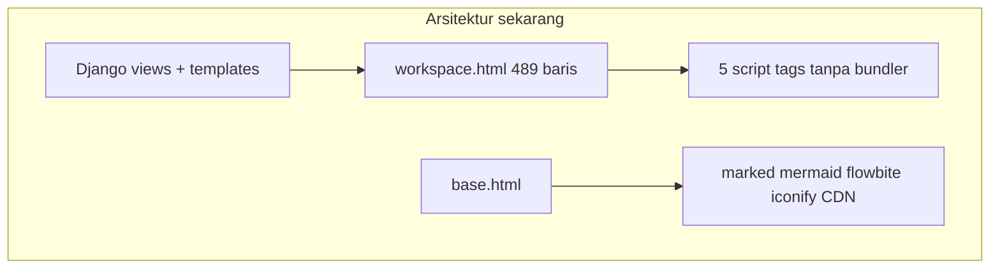
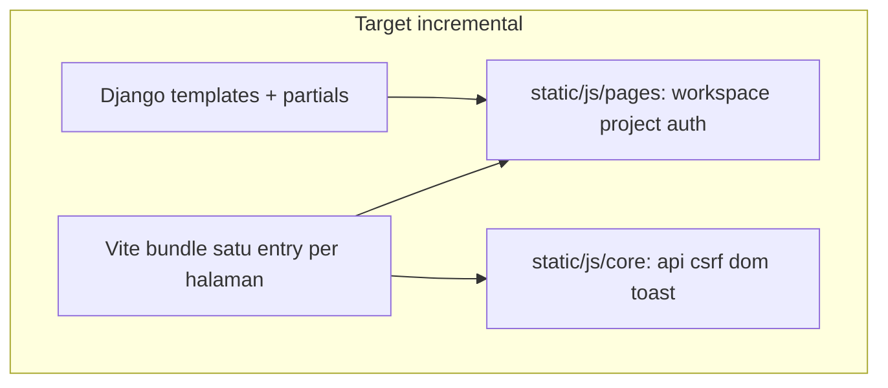
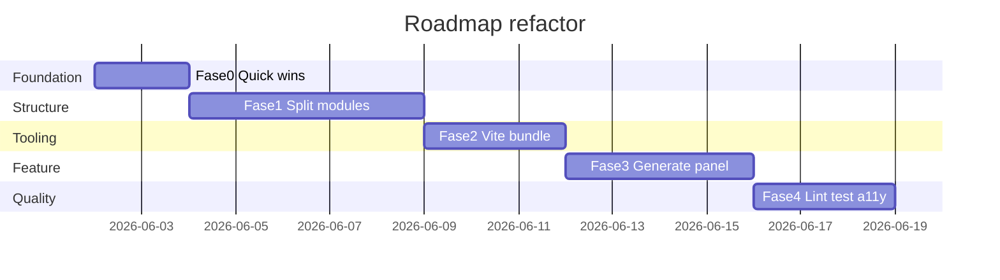

<!-- 6c29e6ea-0014-4167-9014-f33cd8a285f1 -->
---
todos:
  - id: "phase-0-core-utils"
    content: "Fase 0: Buat static/js/core (csrf, api, dom, toast) + pass workspace_max_sources dari Django + fix pesan Indonesia"
    status: pending
  - id: "phase-1-split-modules"
    content: "Fase 1: Pecah sources.js & index.js; partials workspace.html; orchestrator index tipis"
    status: pending
  - id: "phase-2-vite"
    content: "Fase 2: Setup Vite multi-entry, bundle marked/mermaid dari npm, update Dockerfile & script tags"
    status: pending
  - id: "phase-3-generate"
    content: "Fase 3: Modul generate + aktifkan panel kanan, polling job API apps/generate"
    status: pending
  - id: "phase-4-quality"
    content: "Fase 4: ESLint + Vitest smoke tests + a11y modal/chat"
    status: completed
isProject: false
---
# Rencana Refactor Frontend MythosNote (Incremental)

## Kondisi saat ini

Frontend bukan SPA terpisah; ia hidup di dalam Django:

- `templates/workspace.html`: ~489 baris (monolitik; banyak markup duplikat panel)
- `static/js/workspace/sources.js`: ~568 baris (god-class; `innerHTML` besar)
- `static/js/workspace/index.js`: ~270 baris (upload modal; seharusnya modul terpisah)
- `static/js/workspace/chat.js`: ~271 baris (ES module; import `marked` dari CDN)
- `static/js/workspace/layout.js` + `static/js/workspace/selection.js`: ~420 baris (IIFE + `window.*`)
- `static/js/project.js`: ~340 baris (CRUD workspace via fetch)
- `static/js/toast/*` + `static/js/auth/validation.js`: ~550 baris (cukup rapi)
- `static/css/input.css` → `static/css/output.css`: Tailwind v4 CLI (tanpa pipeline PostCSS/JS bundler)

**Stack:** Tailwind v4 (`npm run build:css`), Flowbite 4, Iconify CDN, marked + mermaid dari CDN di [`templates/base.html`](templates/base.html), dependensi npm (`marked`, `mermaid`, `aos`) belum dibundle.



---

## Masalah utama (prioritas fix)

1. **Duplikasi utilitas** — CSRF di 4 tempat (`getCookie`, `getCSRFToken`, `getCsrfToken`), `escapeHtml` di `chat.js` dan `sources.js`, toast via `showToast` vs `ToastManager`.
2. **Campuran sistem modul** — `chat.js` pakai `type="module"` + CDN ESM; file lain IIFE + global `window.Workspace*`.
3. **Konfigurasi tidak sinkron** — `sources.js` hardcode `maxSources = 5`; backend [`WORKSPACE_MAX_SOURCES=15`](config/settings.py). UI copy masih "1-5 file".
4. **Generate panel mati** — Template tombol disabled "Segera hadir", padahal API sudah ada di [`apps/generate/urls.py`](apps/generate/urls.py) (`POST /api/workspace/<id>/generate/`, `GET /api/generate/<job_id>/`).
5. **Coupling global** — `window.workspaceSources`, `WorkspaceSelection`, event `sourceSelectionChanged`; sulit di-test dan di-debug.
6. **Risiko maintainability** — Banyak string HTML inline; sebagian sudah di-escape, tapi pola tidak konsisten.
7. **Pesan campur bahasa** — Error English di `sources.js` ("Failed to load sources") vs UI Indonesia.
8. **Dependensi ganda marked** — CDN di `base.html` + import CDN di `chat.js`; `package.json` punya `marked` tapi tidak dipakai build.

---

## Target arsitektur (setelah refactor)



Prinsip:
- **Satu entry bundle per halaman** (`workspace`, `project`, `auth`) — tidak full SPA.
- **Core shared** diekspor sebagai modul ES, bukan `window.*` (kecuali shim sementara saat migrasi).
- **Konfigurasi dari Django** lewat `data-*` di `#workspace-data` (sudah ada pola ini).

---

## ✅ Fase 0 — Quick wins (1–2 hari, tanpa bundler)

- Buat shared CSRF + fetch wrapper
  - Baru: `static/js/core/csrf.js`, `static/js/core/api.js`
  - Isi: `getCsrfToken()` + `apiFetch(url, opts)` (default header CSRF)
- Buat shared escape + toast
  - `static/js/core/dom.js`
  - Fokus pakai `ToastManager` (kurangi `window.showToast`)
- Fix quota UI
  - `sources.js`, `workspace.html`, view context
  - Pass `data-max-sources="{{ workspace_max_sources }}"` dari [`config/views.py`](config/views.py); hapus hardcode `5`
- Lokalisasi error
  - `sources.js`: ganti pesan English → Indonesia
- Urutan script
  - `workspace.html`: pastikan core → sources/layout/selection → chat → index (atau satu init)

**Context Django** — tambah di `workspace()` view:

```python
"context": {
    "active_workspace": active_workspace,
    "workspace_max_sources": settings.WORKSPACE_MAX_SOURCES,
}
```

---

## ✅ Fase 1 — Struktur folder & pecah modul (3–5 hari)

Struktur target:

```
static/js/
├── core/
│   ├── api.js          # fetch + CSRF + error parsing
│   ├── csrf.js
│   ├── dom.js          # escapeHtml, formatBytes
│   └── toast.js        # re-export ToastManager helpers
├── workspace/
│   ├── index.js        # orchestrator DOMContentLoaded saja
│   ├── sources/
│   │   ├── list.js     # fetch, render, empty/loading states
│   │   ├── item.js     # createSourceItemHTML, status badge
│   │   ├── poll.js     # pollSourceStatus
│   │   └── delete.js
│   ├── upload-modal.js # pindah dari index.js
│   ├── chat/
│   │   ├── messages.js # render user/bot/loading
│   │   ├── session.js  # loadChatHistory, session_id
│   │   └── input.js    # textarea, checkSelection
│   ├── layout.js       # tetap, kurangi duplikasi toggle logic
│   └── selection.js
├── pages/
│   ├── project.js
│   └── auth-validation.js
└── toast/              # existing, import dari core
```

**[`sources.js`](static/js/workspace/sources.js)** — pecah menjadi 4 file; class `WorkspaceSources` hanya koordinasi (facade), bukan 500+ baris.

**[`index.js`](static/js/workspace/index.js)** — hanya init:

```javascript
// target ~30 baris
import { initUploadModal } from './upload-modal.js';
import { WorkspaceSources } from './sources/index.js';
// ...
```

**Template partials** — pecah [`workspace.html`](templates/workspace.html):

- `templates/workspace/_header.html`
- `templates/workspace/_sources_panel.html`
- `templates/workspace/_chat_panel.html`
- `templates/workspace/_generate_panel.html`
- `templates/workspace/_upload_modal.html`
- `templates/workspace/_mobile_tabs.html`

Manfaat: review UI per panel, kurangi konflik git.

---

## ✅ Fase 2 — Bundler ringan Vite (2–3 hari)

Tambah devDependency Vite di [`package.json`](package.json):

```json
"scripts": {
  "dev:js": "vite build --watch",
  "build:js": "vite build",
  "build": "npm run build:css && npm run build:js"
}
```

`vite.config.js` — multi-entry:

- `workspace` → `static/dist/workspace.js`
- `project` → `static/dist/project.js`

Template ganti banyak `<script>` menjadi:

```html
<script type="module" src=""></script>
```

**Marked & mermaid:** import dari `node_modules` (versi di-lock di `package.json`), hapus CDN duplicate di `chat.js` dan pertimbangkan load conditional hanya di halaman workspace (kurangi berat `base.html` global).

**Dockerfile** — pastikan `npm run build` memanggil `build:js` + `build:css`.

---

## ✅ Fase 3 — Generate panel (integrasi API, 3–4 hari) 

Backend sudah siap; frontend belum.

- UI aktif
  - Hapus `disabled` pada 4 tombol di `_generate_panel.html`
- Modul baru
  - `static/js/workspace/generate/index.js`
- POST job
  - `POST /api/workspace/{id}/generate/` body `{ action, source_ids?, title? }`
- Poll status
  - `GET /api/generate/{job_id}/` interval seperti `pollSourceStatus`
- Render hasil
  - Ringkasan/quiz: markdown via `marked`
  - Mindmap: `mermaid.render`
  - Tabel: HTML table
- Daftar job (opsional)
  - cek endpoint list per workspace di [`apps/generate/views.py`](apps/generate/views.py)

Reuse pola polling dari [`sources.js`](static/js/workspace/sources.js) `pollIntervals` Map.

---

## ✅ Fase 4 — Kualitas & DX (berkelanjutan)

- Lint
  - ESLint flat config + plugin untuk risiko `innerHTML`
- Test
  - Vitest untuk `core/api`, `dom.escapeHtml`, parsing response error
- A11y
  - Modal upload: focus trap, `aria-modal`
  - Chat: `aria-live` pada container pesan
- Performance
  - Debounce poll
  - Virtualisasi daftar sumber jika >20 (future)
- CSS
  - Konsolidasi `font-['Manrope']` → utility `font-manrope` di [`input.css`](static/css/input.css)

---

## Fase 5 — Opsional (setelah stabil)

- **Import maps tanpa Vite** — hanya jika ingin zero-build di dev (kurang disarankan setelah Fase 2).
- **Komponen HTML `<template>`** — ganti string HTML di JS dengan clone `template#source-item` (kurangi XSS surface).
- **HTMX untuk auth/forms** — out of scope incremental; pertahankan `validation.js`.

---

## Urutan eksekusi yang disarankan



---

## Risiko & mitigasi

- Regresi upload/chat
  - Checklist manual: upload PDF, poll ready, chat dengan 0/1/N sumber, delete source
- Cache static lama
  - `?v=` atau `ManifestStaticFilesStorage` di production
- Breaking `window.workspaceSources`
  - Shim 1 sprint: `window.workspaceSources = instance` sampai semua referensi internal pindah
- Vite + Django static
  - Output ke `static/dist/`; jangan commit jika CI build; atau commit untuk deploy sederhana

---

## Definisi selesai (DoD)

- Tidak ada duplikasi CSRF/escape di >1 file
- `WORKSPACE_MAX_SOURCES` tampil benar di UI
- Workspace: 1 bundle JS, ≤6 file template partial
- Generate panel fungsional end-to-end dengan polling
- `npm run build` menghasilkan CSS + JS untuk Docker

---
## Workflow Git (sesuai request: branch dulu, bertahap)

Asumsi base branch: `develop`. Strategi: 1 branch untuk semua fase (commit per fase).

### Step awal (sebelum build apa pun)
- Buat branch baru dulu:
  - `git checkout develop`
  - `git checkout -b refactor/frontend-incremental`

### Untuk tiap fase (0 s/d 4)
1. Implementasi fase (hanya scope fase tsb)
2. Build (sesuai milestone fase tsb)
   - Fase 0/1: `npm run build:css` (tanpa bundler JS tambahan)
   - Fase 2+: jalankan script build JS + CSS sesuai konfigurasi (mis. `npm run build`)
3. Update [`CHANGELOG.md`](CHANGELOG.md) (1-3 bullet untuk fase tsb)
4. Commit
   - `git add ...`
   - `git commit -m "refactor(frontend): <fase> (why)"`

---

## Di luar scope (sesuai pilihan incremental)

- Migrasi React/Vue SPA
- Penggantian Django templates dengan SSR framework lain
- i18n framework (cukup konsistensi bahasa manual dulu)
