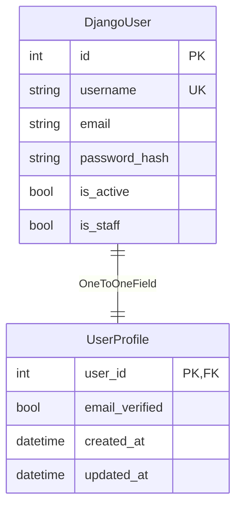
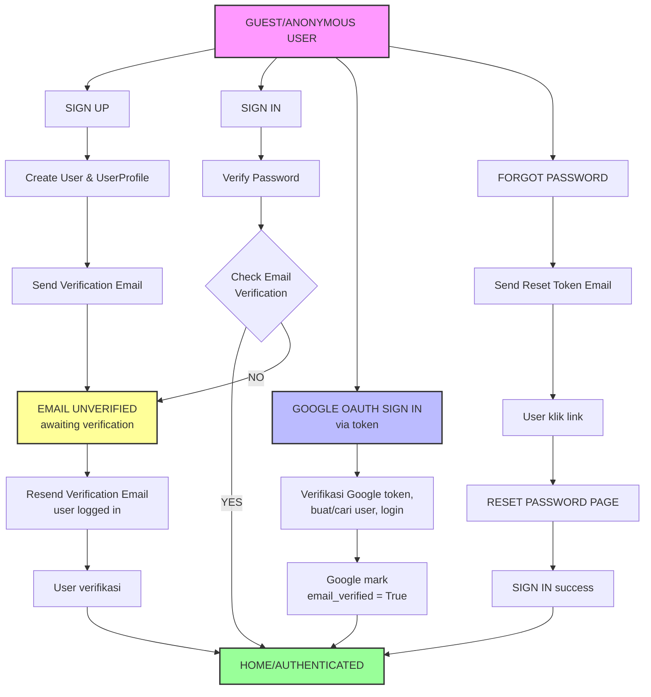

# Panduan Lengkap Sistem Autentikasi MythosNote

Dokumentasi ini menjelaskan implementasi sistem autentikasi aplikasi MythosNote dengan detail yang mudah dipahami, dirancang untuk pemula hingga pengembang berpengalaman.

---

## 📋 Daftar Isi

1. [Pengenalan Sistem](#pengenalan-sistem)
2. [Arsitektur Database](#arsitektur-database)
3. [Alur Autentikasi](#alur-autentikasi)
4. [Komponen Utama](#komponen-utama)
5. [Alur Terperinci Setiap Fitur](#alur-terperinci-setiap-fitur)
6. [Keamanan & Rate Limiting](#keamanan--rate-limiting)
7. [Dekorator & Proteksi Rute](#dekorator--proteksi-rute)
8. [Template & UI](#template--ui)
9. [Cara Menggunakan API](#cara-menggunakan-api)
10. [Async Email via Redis/RQ (Optional)](#async-email-via-redisrq-optional)
11. [Troubleshooting](#troubleshooting)

---

## Pengenalan Sistem

### Apa Itu Sistem Autentikasi?

Sistem autentikasi adalah mekanisme untuk **memverifikasi identitas pengguna** sebelum memberikan akses ke fitur-fitur aplikasi. Di MythosNote, sistem ini menangani:

- ✅ Registrasi akun baru (Sign Up)
- ✅ Masuk dengan email/username dan password (Sign In)
- ✅ Verifikasi email untuk mengakses fitur utama
- ✅ Lupa & reset password
- ✅ Login melalui Google OAuth
- ✅ Pembatasan percobaan login (rate limiting)
- ✅ Manajemen sesi pengguna (session management)
- ✅ Pelacakan penggunaan pengguna untuk kuota AI

### Alasan Pentingnya Email Verification

Email verification memastikan:
- Pengguna menggunakan email yang **valid dan milik mereka**
- Mencegah spambot membuat akun dengan email palsu
- Memastikan pengguna dapat **menerima notifikasi penting**
- Gerbang akses untuk fitur-fitur inti aplikasi

---

## Arsitektur Database

### Model `UserProfile`

```python
class UserProfile(models.Model):
    user = models.OneToOneField(User, on_delete=models.CASCADE)
    email_verified = models.BooleanField(default=False)
    created_at = models.DateTimeField(auto_now_add=True)
    updated_at = models.DateTimeField(auto_now=True)
```

**Penjelasan:**
- **`user`**: Relasi 1-ke-1 dengan Django's built-in `User` model
  - `OneToOneField` memastikan setiap user punya 1 profile, dan sebaliknya
  - `on_delete=CASCADE`: Jika user dihapus, profilenya otomatis terhapus juga
- **`email_verified`**: Boolean flag untuk track apakah email sudah diverifikasi
  - Default `False` saat user baru mendaftar
  - Berubah jadi `True` setelah user klik link verifikasi
- **`created_at`**: Timestamp otomatis saat profile dibuat (tidak bisa diubah)
- **`updated_at`**: Timestamp otomatis yang selalu diupdate saat ada perubahan

**Diagram Relasi:**


### Model `UserUsage`

```python
class UserUsage(models.Model):
    user = models.ForeignKey(User, null=True, blank=True, on_delete=models.CASCADE)
    identifier = models.CharField(max_length=255, blank=True)
    ip_address = models.GenericIPAddressField(null=True, blank=True)
    date = models.DateField()
    prompt_count = models.PositiveIntegerField(default=0)
    generate_count = models.PositiveIntegerField(default=0)
    failed_login_count = models.PositiveIntegerField(default=0)
    failed_login_window_started_at = models.DateTimeField(null=True, blank=True)
    last_failed_login_at = models.DateTimeField(null=True, blank=True)
    
    class Meta:
        constraints = [
            models.UniqueConstraint(
                fields=["user", "identifier", "date"],
                name="unique_user_usage_per_identifier_day",
            ),
        ]
```

**Penjelasan:**
- **`user`**: ForeignKey opsional ke User
  - Bisa `null=True` untuk melacak guest/anonymous attempts
- **`identifier`**: Normalisasi dari email/username untuk tracking
  - Contoh: "user@email.com" → "user@email.com" (lowercase)
- **`ip_address`**: IP address pengguna saat login attempt
- **`date`**: Tanggal untuk tracking per-hari (per-day quotas)
- **`failed_login_count`**: Counter untuk percobaan login gagal
- **`failed_login_window_started_at`**: Waktu mulai rate-limit window (15 menit)
  - Jika diisi, user sedang dalam "status diblokir sementara"

**Kegunaan:**
- 📊 Melacak penggunaan AI prompt & generate per hari
- 🔒 Rate limiting untuk login attempts
- 📈 Analytics penggunaan fitur
- 🚫 Deteksi dan pencegahan brute force

**Constraint Unik:**
Memastikan hanya ada 1 record per kombinasi `(user, identifier, date)`:
- Jika `user=123`, `identifier="john"`, `date="2026-05-05"`, hanya boleh ada 1 row
- Ini mencegah duplikat data dan memudahkan aggregate queries

---

## Alur Autentikasi

### Diagram Alur Utama



---

## Komponen Utama

### 1. **accounts/models.py** - Database Models

**File:** [accounts/models.py](../accounts/models.py)

```python
# UserProfile: Profil kecil terpisah dari User Django
user.profile.email_verified  # Check verification status

# UserUsage: Tracking penggunaan & rate limiting
UserUsage.objects.get_or_create(user=user, identifier="john", date=today)
```

---

### 2. **accounts/views.py** - View Functions (Controllers)

**File:** [accounts/views.py](../accounts/views.py)

Setiap function menangani satu endpoint:

| Function | URL | Method | Deskripsi |
|----------|-----|--------|-----------|
| `sign_in()` | `/signin/` | GET, POST | Login dengan email/username & password |
| `sign_up()` | `/signup/` | GET, POST | Registrasi akun baru |
| `google_sign_in()` | `/auth/google/` | POST | Login via Google OAuth |
| `email_unverified()` | `/email-unverified/` | GET | Halaman verifikasi email (gerbang) |
| `resend_verification()` | `/resend-verification/` | POST | Kirim ulang email verifikasi |
| `verify_email()` | `/verify-email/<uid>/<token>/` | GET | Endpoint verifikasi dari email link |
| `forgot_password()` | `/forgot-password/` | GET, POST | Minta reset password |
| `password_reset_confirm()` | `/reset/<uid>/<token>/` | GET, POST | Confirm & set password baru |
| `sign_out()` | `/logout/` | POST | Logout & destroy session |

---

### 3. **accounts/decorators.py** - Permission Guards

**File:** [accounts/decorators.py](../accounts/decorators.py)

Dekorator adalah "penjaga" di pintu setiap view:

#### `@guest_required`
```python
@guest_required
def sign_in(request):
    # Hanya user yang belum login bisa akses
    # Jika sudah login, redirect ke 'home'
```

**Logika:**
1. User cek apakah `request.user.is_authenticated`?
2. Jika YES → redirect ke `home` (Anda sudah login, tidak perlu sign in lagi)
3. Jika NO → lanjut ke view function

**Digunakan di:** `sign_in()`, `sign_up()`, `forgot_password()`, `password_reset_confirm()`

#### `@verified_email_required`
```python
@verified_email_required
def dashboard(request):
    # Hanya user dengan email verified bisa akses
```

**Logika:**
1. User cek apakah `request.user.is_authenticated`?
   - Jika NO → redirect ke login page
2. User cek apakah `is_email_verified(user)`?
   - Jika YES → lanjut ke view function
   - Jika NO → redirect ke `email_unverified` (gerbang verifikasi)

**Digunakan di:** Fitur-fitur core (workspace, AI features, dll) - akan ditambah kemudian

---

### 4. **accounts/forms.py** - Form Validation

**File:** [accounts/forms.py](../accounts/forms.py)

Form adalah layer validasi data sebelum masuk database:

#### `SignInForm`
```python
class SignInForm(forms.Form):
    username = forms.CharField(max_length=254)
    password = forms.CharField(widget=forms.PasswordInput)
```

**Validasi khusus:**
- Username bisa email atau username (check both)
- Password diverifikasi dengan `authenticate()` function
- Error message: "Email/username atau password salah."

#### `SignUpForm`
```python
class SignUpForm(forms.ModelForm):
    password = forms.CharField(widget=forms.PasswordInput)
    password_confirm = forms.CharField(widget=forms.PasswordInput)
```

**Validasi khusus:**
- Email unique check (case-insensitive)
- Username unique check (case-insensitive)
- Password & password_confirm harus match
- Password strength validation (Django's default: min 8 chars, not all numeric, dll)

#### `ForgotPasswordForm`
```python
class ForgotPasswordForm(forms.Form):
    email = forms.EmailField()
```

Simple email-only form (tidak reveal apakah email terdaftar atau tidak).

#### `PasswordResetConfirmForm`
Warisan dari Django's `SetPasswordForm` - built-in untuk reset password.

---

### 5. **accounts/utils.py** - Helper Functions

**File:** [accounts/utils.py](../accounts/utils.py)

Utility functions yang dipakai di views & decorators:

#### Rate Limiting Functions
```python
get_login_usage(request, identifier)
# Fetch/create today's usage record

is_login_rate_limited(usage)
# Check jika user sudah exceed 5 attempts dalam 15 menit

record_failed_login(usage)
# Increment failed_login_count & set window timer

clear_failed_login_tracking(usage)
# Reset counters setelah login success
```

**Contoh alur:**
```
1. User input username & password SALAH
   → record_failed_login(usage)
   → failed_login_count = 1

2. User coba lagi, SALAH lagi
   → record_failed_login(usage)
   → failed_login_count = 2

3. ... (3 kali lagi = total 5 kali)

4. User coba ke-6 kali
   → is_login_rate_limited(usage) = True
   → Block dengan pesan: "Terlalu banyak percobaan login..."

5. User tunggu 15 menit, atau di menit ke-16 coba lagi
   → Window expired
   → is_login_rate_limited(usage) = False
   → Blokir dibuka, user bisa coba login lagi
```

#### Email Verification Functions
```python
is_email_verified(user)
# Get/create UserProfile & check email_verified flag

send_verification_email(request, user)
# Generate signed token URL & send via email

send_password_reset_email(request, user)
# Generate signed reset token URL & send via email
```

#### Email Token Generation
```python
uid = urlsafe_base64_encode(force_bytes(user.pk))
# Encode user ID menjadi URL-safe string
# Contoh: user.id=123 → "MTIz"

token = default_token_generator.make_token(user)
# Generate signed token (Django default)
# Contoh: "xyz-abc-def..."
# Token ini hanya valid untuk user tertentu, & expire dalam beberapa hari
```

#### Google OAuth Verification
```python
verify_google_credential(credential)
# Validate Google token via Google's tokeninfo endpoint
# Verifikasi `aud` (audience) cocok dengan GOOGLE_OAUTH_CLIENT_ID
# Return: {"email": ..., "name": ..., "email_verified": ...}
```

---

### 6. **accounts/urls.py** - URL Routing

**File:** [accounts/urls.py](../accounts/urls.py)

```python
urlpatterns = [
    path("signin/", views.sign_in, name="signin"),
    path("signup/", views.sign_up, name="signup"),
    path("auth/google/", views.google_sign_in, name="google_signin"),
    path("forgot-password/", views.forgot_password, name="forgot_password"),
    path("reset/<uidb64>/<token>/", views.password_reset_confirm),
    path("email-unverified/", views.email_unverified, name="email_unverified"),
    path("resend-verification/", views.resend_verification, name="resend_verification"),
    path("verify-email/<uidb64>/<token>/", views.verify_email, name="verify_email"),
    path("logout/", views.sign_out, name="logout"),
]
```

Semua route di-mount di `config/urls.py`:
```python
urlpatterns = [
    path('', views.home, name='home'),
    path('', include('accounts.urls')),  # ← Include accounts URLs di root
]
```

Jadi URL final:
- `/signin/` (bukan `/accounts/signin/`)
- `/signup/`
- `/verify-email/MTIz/xyz-token/`
- dll

---

### 7. **accounts/context_processors.py** - Template Context

**File:** [accounts/context_processors.py](../accounts/context_processors.py)

Context processor adalah function yang "inject" data ke semua templates secara otomatis:

```python
def auth_settings(request):
    email_verified = False
    if request.user.is_authenticated:
        profile, _ = UserProfile.objects.get_or_create(user=request.user)
        email_verified = profile.email_verified

    return {
        "GOOGLE_OAUTH_CLIENT_ID": settings.GOOGLE_OAUTH_CLIENT_ID,
        "AUTH_EMAIL_VERIFIED": email_verified,
    }
```

**Hasil:** Di semua template, bisa akses:
```html
{{ GOOGLE_OAUTH_CLIENT_ID }}  <!-- Public Google Client ID -->
{{ AUTH_EMAIL_VERIFIED }}     <!-- True jika email sudah verified -->
```

Register di `settings.py`:
```python
'OPTIONS': {
    'context_processors': [
        ...
        'accounts.context_processors.auth_settings',  # ← Added
    ],
},
```

---

## Alur Terperinci Setiap Fitur

### Fitur 1: Sign Up (Registrasi)

**URL:** `POST /signup/`

**Step-by-step:**

```
1. User akses GET /signup/
   → Render signup.html dengan form kosong
   
2. User input:
   - username: "johndoe"
   - email: "john@example.com"
   - password: "SecurePass123!"
   - password_confirm: "SecurePass123!"
   
3. User submit POST /signup/
   → View sign_up() dipanggil
   
4. Validasi form:
   a) Email sudah terdaftar? NO → OK
   b) Username sudah terdaftar? NO → OK
   c) Password & confirm match? YES → OK
   d) Password strength OK? YES → OK
   
5. Form valid:
   → Create Django User:
      - username: "johndoe"
      - email: "john@example.com"
      - password: (hashed, tidak disimpan plaintext)
      - is_active: True
      - is_staff: False
   
   → Signal triggered (dari django.db.models.post_save):
      - Auto-create UserProfile untuk user baru
      - profile.email_verified = False
   
   → login(request, user):
      - Create Django session
      - request.user sekarang authenticated
   
   → send_verification_email(request, user):
      - Generate uid = urlsafe_base64_encode(user.pk)
      - Generate token = default_token_generator.make_token(user)
      - Build URL: /verify-email/MTIz/xyz-token/
      - Kirim email dengan subject "Verifikasi email MythosNote"
   
   → messages.success(...): Flash message ke session
   
   → redirect("email_unverified"):
      - Redirect ke /email-unverified/
      
6. User lihat: "Email belum terverifikasi"
   - Tombol: "Kirim Ulang Link"
   - Tombol: "Logout / Ganti Akun"
   
7. User check email inbox
   → Klik link verifikasi
   → GET /verify-email/MTIz/xyz-token/
   
8. Verify endpoint:
   a) Decode uid → user.id = 123
   b) Get user dari database
   c) Check token dengan default_token_generator.check_token(user, token)
   d) Jika valid:
      - Set user.profile.email_verified = True
      - login(request, user) (update session)
      - messages.success(...): "Email berhasil diverifikasi."
      - redirect("home")
   e) Jika invalid/expired:
      - messages.error(...): "Link verifikasi tidak valid atau sudah kedaluwarsa."
      - render("auth/email_verification_invalid.html")
      
9. User ke home page
   → request.user.is_authenticated = True
   → user.profile.email_verified = True
   → Full akses ke workspace & fitur core
```

**Database state sesudah signup:**

| Table | Data |
|-------|------|
| auth_user | id=1, username="johndoe", email="john@example.com", password_hash="...", is_active=1 |
| accounts_userprofile | id=1, user_id=1, email_verified=0, created_at="2026-05-05 10:00:00" |
| accounts_userusage | user_id=1, identifier="johndoe", date="2026-05-05", failed_login_count=0 |

**Email yang dikirim:**

```
To: john@example.com
Subject: Verifikasi email MythosNote

Halo,

Klik link berikut untuk memverifikasi email MythosNote Anda:
http://localhost:8000/verify-email/MTIz/xyz-abc-def-token/

Jika Anda tidak membuat akun MythosNote, abaikan email ini.
```

---

### Fitur 2: Sign In (Login)

**URL:** `POST /signin/`

**Step-by-step:**

```
1. User akses GET /signin/
   → @guest_required check:
      - Sudah login? NO → OK lanjut
      - Sudah login? YES → redirect("home")
   → Render signin.html dengan form kosong
   
2. User input:
   - username: "john@example.com" (atau "johndoe")
   - password: "SecurePass123!"
   
3. User submit POST /signin/
   → View sign_in() dipanggil
   
4. Cek rate limiting:
   a) get_login_usage(request, "john@example.com")
      → UserUsage record untuk hari ini (atau create baru)
   b) is_login_rate_limited(usage)?
      - Jika yes (5+ attempts dalam 15 min) → error message & re-render form
      - Jika no → lanjut
   
5. Validasi form:
   a) SignInForm.clean():
      - Cek apakah "@" di identifier?
        - YES (email) → Query User.objects.filter(email__iexact="john@example.com")
        - NO (username) → Gunakan langsung sebagai username
      - authenticate(request, username=auth_username, password=password)
        - Return user jika password benar, else None
   b) Jika form valid:
      - self.user = authenticated user object
   
6. Form valid & password benar:
   a) login(request, self.user):
      - Create Django session
      - request.user sekarang authenticated
   
   b) clear_failed_login_tracking(usage):
      - Set failed_login_count = 0
      - Set failed_login_window_started_at = None
   
   c) is_email_verified(user)?
      - YES → redirect("home")
      - NO → redirect("email_unverified")
   
7. Form invalid & password salah:
   a) record_failed_login(usage):
      - Increment failed_login_count
      - Set failed_login_window_started_at (jika belum)
      - Set last_failed_login_at = now()
   
   b) messages.error(...): "Email/username atau password salah."
   
   c) Re-render form dengan error (keep username field filled)
```

**Database state:**

| Table | Data |
|-------|------|
| django_session | session_key="...", session_data="...", expire_date="2026-05-19" |
| accounts_userusage | ..., failed_login_count=0 atau > 0 |

---

### Fitur 3: Email Verification Gate

**URL:** `GET /email-unverified/`

**Peraturan:**
- Hanya user yang sudah login (`@login_required`)
- Hanya user dengan `email_verified=False` bisa lihat halaman ini
- Jika email sudah verified, redirect ke home

**Step-by-step:**

```
1. User (logged in, unverified) akses GET /email-unverified/
   → Decorator check:
      - @login_required: is_authenticated? YES → OK
      - if is_email_verified(user)? NO → lanjut
   
   → Render auth/email_unverified.html
   
2. Template tampilkan:
   - Pesan: "Email belum terverifikasi. Cek inbox untuk link verifikasi..."
   - Tombol 1: "Kirim Ulang Link"
   - Tombol 2: "Logout / Ganti Akun"
   
3. User click "Kirim Ulang Link"
   → POST /resend-verification/
   → View resend_verification():
      a) Check is_email_verified? NO → OK lanjut
      b) send_verification_email(request, user)
      c) messages.success(...): "Link verifikasi baru sudah dikirim."
      d) redirect("email_unverified")
      
4. User click "Logout / Ganti Akun"
   → POST /logout/
   → View sign_out():
      a) logout(request): Destroy session
      b) redirect("home")
```

**Tujuan fitur ini:**
- Memaksa user memverifikasi email sebelum akses workspace
- Pastikan email valid (pengguna bisa receive notifications)
- Gerbang yang mudah dipahami

---

### Fitur 4: Email Verification via Link

**URL:** `GET /verify-email/<uidb64>/<token>/`

**Step-by-step:**

```
1. User klik link dari email:
   http://localhost:8000/verify-email/MTIz/xyz-abc-token/
   
   → GET /verify-email/MTIz/xyz-abc-token/
   
2. View verify_email(request, uidb64, token):
   
   a) get_user_from_uid("MTIz"):
      - Decode: urlsafe_base64_decode("MTIz") → b"123"
      - force_str() → "123"
      - Query: User.objects.get(pk=123)
      - Return user object atau None
   
   b) Check token:
      - default_token_generator.check_token(user, "xyz-abc-token")
      - Token ini tied ke specific user & password
      - Jika user ubah password, token invalid
      - Token expire dalam beberapa hari (Django default: 1 hari)
   
   c) Jika valid:
      - user.profile.email_verified = True
      - user.profile.save()
      - login(request, user): Re-create session
      - messages.success(...): "Email berhasil diverifikasi."
      - redirect("home")
   
   d) Jika invalid/expired:
      - messages.error(...): "Link tidak valid atau sudah kedaluwarsa."
      - render("auth/email_verification_invalid.html")
      - User bisa klik link di halaman ini untuk kembali ke resend page
      
3. User akses home
   → @verified_email_required decorator (di fitur core nanti):
      - Check email_verified? YES → full akses
```

---

### Fitur 5: Forgot Password

**URL:** `GET,POST /forgot-password/`

**Step-by-step:**

```
1. User lupa password, akses GET /forgot-password/
   → @guest_required: Sudah login? NO → OK lanjut
   → Render forgot_password.html dengan form kosong
   
2. User input email: "john@example.com"
   → POST /forgot-password/
   
3. View forgot_password():
   a) Validasi email format
   b) Query User.objects.filter(email__iexact="john@example.com", is_active=True)
      - Bisa ada multiple users dengan email sama? NO (email field ada constraint)
      - Jika tidak ada user → loop tidak jalan, tidak ada email dikirim
   
   c) For each user dengan email tersebut:
      - send_password_reset_email(request, user):
        a) Generate uid = urlsafe_base64_encode(user.pk)
        b) Generate token = default_token_generator.make_token(user)
        c) Build URL: /reset/MTIz/xyz-token/
        d) Kirim email dengan link ini
   
   d) messages.success(...): 
      "Jika email terdaftar, link reset password akan dikirim."
      (Pesan generic, tidak reveal apakah email terdaftar atau tidak)
   
   e) redirect("signin")
   
4. User check email inbox
   → Klik link reset password
   → GET /reset/MTIz/xyz-token/
```

**Alasan generic message:**
- Keamanan! Jangan reveal apakah email terdaftar atau tidak
- Prevent attackers dari enumerate valid emails

---

### Fitur 6: Password Reset Confirm

**URL:** `GET,POST /reset/<uidb64>/<token>/`

**Step-by-step:**

```
1. User klik link dari email:
   http://localhost:8000/reset/MTIz/xyz-token/
   
   → GET /reset/MTIz/xyz-token/
   
2. View password_reset_confirm():
   
   a) get_user_from_uid("MTIz")
      - Decode uid → user object
   
   b) default_token_generator.check_token(user, "xyz-token")
      - Token valid & belum expired? YES → lanjut
      - Token invalid/expired? NO → render error page
   
   c) Jika token valid:
      - Render password_reset_confirm.html dengan PasswordResetConfirmForm
      - Form ada 2 field: new_password1, new_password2
      - User input & submit
   
   d) POST /reset/MTIz/xyz-token/:
      - PasswordResetConfirmForm.save():
        a) Validasi password cocok & strength OK
        b) Set user.password = hashed_password
        c) user.save()
      - messages.success(...): "Password berhasil direset. Silakan login."
      - redirect("signin")
   
   e) Jika token invalid/expired:
      - render("auth/password_reset_invalid.html")
      - User bisa klik link di halaman untuk kembali ke forgot password
      
3. User login dengan password baru
   → POST /signin/ dengan password baru
```

---

### Fitur 7: Google OAuth Sign In

**URL:** `POST /auth/google/`

**Prerequisite:**
- Setup Google OAuth di Google Cloud Console
- Config `GOOGLE_OAUTH_CLIENT_ID` di `settings.py`
- Tambahkan `SECURE_CROSS_ORIGIN_OPENER_POLICY = 'same-origin-allow-popups'` pada `settings.py` (Mencegah masalah popup token nyangkut/stuck di GSI redirect pada Django 4.0+).
- Frontend load Google Identity Services library & handle token generation

**Step-by-step:**

```
1. Frontend (JavaScript):
   a) User klik "Login with Google"
   b) Google Identity Services modal dimunculkan
   c) User confirm dengan Google account
   d) Google return ID token (JWT)
   e) JavaScript POST token ke /auth/google/
   
2. Backend POST /auth/google/:
   a) View google_sign_in():
      - Get credential dari POST data
   
   b) verify_google_credential(credential):
      - HTTP GET ke https://oauth2.googleapis.com/tokeninfo?id_token=...
      - Check apakah `aud` (audience) == GOOGLE_OAUTH_CLIENT_ID
      - Extract: email, name, email_verified dari payload
      - Return: {"email": ..., "email_verified": ...}
   
   c) get_or_create_google_user(payload):
      - Query User.objects.filter(email__iexact=payload["email"])
      - Jika ada → gunakan existing user
      - Jika tidak ada → create new user:
        a) Generate username = build_unique_username("john@gmail.com")
           - Remove "@gmail.com" part → "john"
           - Check unique? If taken, add suffix: "john_1", "john_2", etc
        b) Create User:
           - username: "john_1"
           - email: "john@gmail.com"
           - password: None (social login, tidak set password)
        c) Auto-create UserProfile via signal
      - If payload["email_verified"] = true:
        - user.profile.email_verified = True
        - user.profile.save()
      
   d) login(request, user):
      - Create Django session
   
   e) is_email_verified(user)?
      - YES → redirect("home")
      - NO → redirect("email_unverified")
      
3. Keuntungan Google OAuth:
   - Email sudah diverifikasi oleh Google
   - Tidak perlu password verification
   - Faster signup & login
```

**Error handling:**
```
- Credential not found → "Credential Google tidak ditemukan."
- Token validation fail → "Login Google gagal divalidasi."
- Email already linked to other account (IntegrityError) 
  → "Email Google sudah terhubung ke akun lain."
```

---

### Fitur 8: Logout

**URL:** `POST /logout/`

**Step-by-step:**

```
1. User submit form dengan action="/logout/"
   → POST /logout/
   
2. View sign_out():
   a) logout(request):
      - Delete session key dari server
      - Clear cookies di client
      - request.user menjadi AnonymousUser
   
   b) messages.success(...): "Anda sudah logout."
   
   c) redirect("home"):
      - User kembali ke halaman utama
      - request.user.is_authenticated = False
      
3. Navigation bar update:
   - Hide "Verify Email" link (jika ada)
   - Hide "Logout" button
   - Show "Sign In" link
   - Show "Get Started" button
```

---

## Keamanan & Rate Limiting

### 1. Password Hashing

```python
# Django AUTOMATICALLY hash password:
user.set_password("plaintext_password")
# Database store: pbkdf2_sha256$xyz$...

# Verify:
authenticate(username="john", password="plaintext_password")
# Django auto-compare dengan hash di database
```

**Benefit:**
- Bahkan admin tidak bisa lihat password original
- Jika database compromise, password masih aman

### 2. Rate Limiting pada Login

**Algoritma:**

```python
LOGIN_RATE_LIMIT_ATTEMPTS = 5          # Block setelah 5 attempt gagal
LOGIN_RATE_LIMIT_WINDOW = timedelta(minutes=15)  # Window 15 menit

def is_login_rate_limited(usage):
    # Jika failed_login_count >= 5 dan window belum expired → BLOCK
    
    if not usage.failed_login_window_started_at:
        return False  # Belum ada window, OK
    
    window_expires_at = usage.failed_login_window_started_at + LOGIN_RATE_LIMIT_WINDOW
    if timezone.now() >= window_expires_at:
        # Window sudah expired, reset counter
        usage.failed_login_count = 0
        usage.failed_login_window_started_at = None
        usage.save()
        return False  # OK, bisa coba lagi
    
    # Window masih aktif, check counter
    return usage.failed_login_count >= LOGIN_RATE_LIMIT_ATTEMPTS
```

**Timeline Contoh:**

```
14:00 - Failed attempt #1 → window_started_at = 14:00, count = 1
14:01 - Failed attempt #2 → count = 2
14:02 - Failed attempt #3 → count = 3
14:03 - Failed attempt #4 → count = 4
14:04 - Failed attempt #5 → count = 5, BLOCKED
14:05 - User coba lagi → is_login_rate_limited = True → ERROR
14:15 - User coba lagi → still blocked (exactly at 15 min mark)
14:16 - User coba lagi → window expired! count reset → OK, bisa coba
```

**Tracked by:**
- `UserUsage.identifier` (normalized email/username, case-insensitive)
- `UserUsage.date` (per-day granularity)
- Per IP juga bisa (untuk guest attempts sebelum user ditemukan)

### 3. CSRF Protection

```html
<!-- Template harus include CSRF token di form -->
<form method="post" action="/signin/">
      <!-- Django auto-generate hidden input -->
    <input name="username" type="text" />
    <input name="password" type="password" />
</form>
```

**Middleware di settings.py:**
```python
MIDDLEWARE = [
    ...
    'django.middleware.csrf.CsrfViewMiddleware',
    ...
]
```

**Benefit:**
- Prevent cross-site form submission attacks
- Token tied ke session user

### 4. Secure Password Reset Tokens

```python
# Token generation:
token = default_token_generator.make_token(user)
# Django use: hash(user.pk + user.password + timestamp)
# Token tied ke specific user & password
# Token expire dalam 1-7 hari (configurable)

# Token validation:
valid = default_token_generator.check_token(user, token)
# Jika user ubah password, token invalid otomatis
```

**Benefit:**
- Token tidak reusable setelah password berubah
- Token expire otomatis
- Tidak ada permanent reset link

### 5. Email Verification Tokens

```python
# Sama seperti password reset tokens
uid = urlsafe_base64_encode(force_bytes(user.pk))  # Encode user ID
token = default_token_generator.make_token(user)   # Sign token

# Email link format:
# /verify-email/MTIz/xyz-token/
```

### 6. Google OAuth Audience Check

```python
payload = response.json()
if payload.get("aud") != settings.GOOGLE_OAUTH_CLIENT_ID:
    raise ValueError("Token tidak sesuai client aplikasi")

# Ini prevent:
# - Token dari Google app lain tidak bisa dipakai
# - Man-in-the-middle attacks
```

### 7. IP Address Tracking

```python
def get_client_ip(request):
    # Check X-Forwarded-For header (proxy-aware)
    forwarded_for = request.META.get("HTTP_X_FORWARDED_FOR")
    if forwarded_for:
        return forwarded_for.split(",", 1)[0].strip()
    return request.META.get("REMOTE_ADDR")

# Store di UserUsage.ip_address untuk:
# - Fraud detection
# - Geographic login alerts
# - Brute force from specific IP
```

### 8. Session Security

Django session config di `settings.py`:
```python
SESSION_ENGINE = 'django.contrib.sessions.backends.db'  # Store di database
SESSION_COOKIE_AGE = 1209600  # 2 weeks
SESSION_COOKIE_HTTPONLY = True  # Not accessible via JavaScript
SESSION_COOKIE_SECURE = False  # Set to True in production (HTTPS only)
SESSION_COOKIE_SAMESITE = 'Lax'  # CSRF protection
```

---

## Dekorator & Proteksi Rute

### Cara Pakai Dekorator

**Contoh 1: `@guest_required` (public auth-only pages)**

```python
from accounts.decorators import guest_required

@guest_required
def sign_in(request):
    # Hanya guest (belum login) bisa akses
    # User authenticated → redirect ke home
```

**Contoh 2: `@verified_email_required` (workspace & core features - future)**

```python
from accounts.decorators import verified_email_required

@verified_email_required
def dashboard(request):
    # Hanya user authenticated + email verified bisa akses
    # User tidak login → redirect ke signin
    # User login tapi email belum verified → redirect ke email_unverified
```

### Stacking Multiple Decorators

```python
from django.contrib.auth.decorators import login_required
from django.views.decorators.http import require_POST
from accounts.decorators import verified_email_required

@verified_email_required
@require_POST
def create_note(request):
    # Check order (bottom to top):
    # 1. require_POST: Method harus POST
    # 2. verified_email_required: User harus login & verified
    # 3. Eksekusi function
```

### Custom Decorator Pattern (untuk future)

Jika ingin membuat decorator baru:

```python
from functools import wraps
from django.contrib import messages

def my_feature_required(view_func):
    """Misal: hanya user dengan feature flag tertentu bisa akses"""
    
    @wraps(view_func)
    def wrapper(request, *args, **kwargs):
        if not request.user.is_authenticated:
            return redirect('signin')
        
        if not request.user.profile.has_feature_x:
            messages.warning(request, "Fitur ini belum tersedia untuk Anda.")
            return redirect('home')
        
        return view_func(request, *args, **kwargs)
    
    return wrapper

# Usage:
@my_feature_required
def feature_x_view(request):
    ...
```

---

## Template & UI

### Auth-Aware Navigation (base.html)

```html
<!-- Jika user authenticated -->

    <a href="">Go to Project</a>
    
    <!-- Logout button (contoh ditaruh di navbar/dropdown spesifik) -->
    <form method="post" action="">
        
        <button type="submit">Logout</button>
    </form>

<!-- Jika user belum authenticated (guest) -->

    <!-- Show Sign In link -->
    <a href="">Sign In</a>
    
    <!-- Show Get Started button -->
    <a href="">Get Started</a>

```

### Flash Messages

Notifikasi *toast* / popup pesan menggunakan styling tailwind dan berjalan secara global pada halaman utama seperti yang dicontohkan di `base.html`:

```html
<!-- Django messages framework otomatis via context_processors -->

<div class="fixed top-4 right-4 z-50 flex flex-col gap-2">
    
    <div class="px-4 py-3 rounded shadow-lg text-sm text-white bg-red-600bg-green-600bg-blue-600 transition-opacity duration-300 opacity-90 hover:opacity-100">
        {{ message }}
    </div>
    
</div>

```

**Template view:***
```python
from django.contrib import messages

messages.success(request, "Email berhasil diverifikasi.")
messages.error(request, "Password salah.")
messages.warning(request, "Email belum diverifikasi.")
```

### Form Rendering

```html
<!-- Simple form rendering -->
<form method="post">
    
    {{ form.username }}
    {{ form.password }}
    <button type="submit">Login</button>
</form>

<!-- Manual rendering (more control) -->
<form method="post">
    
    <input 
        type="text" 
        name="username"
        value="{{ form.username.value|default:'' }}"
        placeholder="Email atau Username"
    />
    
        <span class="error">{{ form.username.errors.0 }}</span>
    
</form>
```

### List of Auth Templates

| Template | Purpose |
|----------|---------|
| `templates/signin.html` | Login form page |
| `templates/signup.html` | Registration form page |
| `templates/forgot_password.html` | Forgot password request |
| `templates/base.html` | Base layout (nav, messages, etc) |
| `templates/home.html` | Landing page |
| `templates/auth/email_unverified.html` | Verification gate |
| `templates/auth/email_verification_invalid.html` | Verification link expired |
| `templates/auth/password_reset_confirm.html` | Reset password form |
| `templates/auth/password_reset_invalid.html` | Reset link expired |

---

## Cara Menggunakan API

### Dalam Views

```python
from django.contrib.auth import get_user_model, login, logout
from accounts.decorators import guest_required, verified_email_required
from accounts.models import UserProfile, UserUsage
from accounts.utils import (
    is_email_verified,
    send_verification_email,
    get_login_usage,
    is_login_rate_limited,
)

User = get_user_model()

@verified_email_required
def my_protected_view(request):
    # request.user adalah user object
    # request.user.is_authenticated = True
    # request.user.profile.email_verified = True
    
    profile = request.user.profile
    usage = UserUsage.objects.get(user=request.user, date=today)
    
    return render(request, "my_template.html", {
        "user_email": request.user.email,
        "ai_usage": usage.prompt_count,
    })
```

### Dalam Templates

```html
<!-- Check authentication status -->

    <p>Welcome, {{ request.user.username }}!</p>
    <p>Email: {{ request.user.email }}</p>
    <p>Email verified: {{ AUTH_EMAIL_VERIFIED }}</p>

    <p>Please log in first.</p>


<!-- Generate URLs secara dynamic -->
<a href="">Sign In</a>
<a href="">
    Verify Email
</a>
```

### Dalam Management Commands

```python
# File: accounts/management/commands/send_bulk_verification.py
from django.core.management.base import BaseCommand
from django.contrib.auth import get_user_model
from accounts.utils import send_verification_email
from django.test import RequestFactory

User = get_user_model()

class Command(BaseCommand):
    def handle(self, *args, **options):
        unverified_users = User.objects.filter(
            profile__email_verified=False
        )
        
        # Create fake request untuk build absolute URLs
        factory = RequestFactory()
        request = factory.get('/')
        request.META['HTTP_HOST'] = 'example.com'
        request.META['wsgi.url_scheme'] = 'https'
        
        for user in unverified_users:
            send_verification_email(request, user)
            self.stdout.write(f"Sent to {user.email}")
```

### Admin Interface

```python
# File: accounts/admin.py
from django.contrib import admin
from .models import UserProfile, UserUsage

@admin.register(UserProfile)
class UserProfileAdmin(admin.ModelAdmin):
    list_display = ('user', 'email_verified', 'created_at')
    list_filter = ('email_verified', 'created_at')
    search_fields = ('user__email', 'user__username')

@admin.register(UserUsage)
class UserUsageAdmin(admin.ModelAdmin):
    list_display = ('user', 'identifier', 'date', 'failed_login_count')
    list_filter = ('date',)
    search_fields = ('identifier', 'user__email')
```

---

## Async Email via Redis/RQ (Optional)

Jika ingin menghindari blocking saat kirim email (signup, resend verification, reset password), email dapat dikirim lewat Redis/RQ.

**Ringkasan implementasi:**
- Toggle dengan env `EMAIL_ASYNC=true`
- Job email dipush ke queue `default`
- Koneksi Redis baca dari env `REDIS_URL` (fallback localhost)
- Worker dijalankan via `python manage.py rqworker`

**Langkah setup (ringkas):**

1. Set env di runtime:
   ```bash
   export EMAIL_ASYNC=true
   export REDIS_URL=redis://localhost:6379/0
   ```

2. Jalankan Redis + worker:
   ```bash
   redis-server
   python manage.py rqworker
   ```

3. Pastikan backend email sudah valid (SMTP/SendGrid/Console backend).

**Catatan:**
- Mode async tetap memakai isi email yang sama; hanya cara pengirimannya yang dipindah ke queue.
- Jika Redis/worker mati, email tidak terkirim sampai worker aktif kembali.

---

## Troubleshooting

### Problem: Email tidak terkirim saat signup

**Possible causes:**

1. **Email backend tidak dikonfigurasi**
   ```python
   # settings.py
   EMAIL_BACKEND = 'django.core.mail.backends.console.EmailBackend'  # Development
   # atau
   EMAIL_BACKEND = 'django.core.mail.backends.smtp.EmailBackend'  # Production
   EMAIL_HOST = 'smtp.gmail.com'
   EMAIL_PORT = 587
   EMAIL_USE_TLS = True
   EMAIL_HOST_USER = 'your-email@gmail.com'
   EMAIL_HOST_PASSWORD = 'your-app-password'
   DEFAULT_FROM_EMAIL = 'noreply@mythosnote.com'
   ```

2. **Redis/RQ tidak running (jika pakai async email)**
   ```bash
   redis-server  # Start Redis
   python manage.py rqworker  # Start worker
   ```

3. **Mail folder permission issue**
   ```bash
   chmod -R 755 /path/to/maildir
   ```

**Solution:**

```bash
# Test email configuration
python manage.py shell
>>> from django.core.mail import send_mail
>>> send_mail(
...     "Test subject",
...     "Test message",
...     "from@example.com",
...     ["to@example.com"],
... )
1  # Should return 1 if success
```

---

### Problem: Rate limiting terlalu agresif / terlalu santai

**Edit di `accounts/utils.py`:**

```python
LOGIN_RATE_LIMIT_ATTEMPTS = 5          # Ubah ke 3 atau 10
LOGIN_RATE_LIMIT_WINDOW = timedelta(minutes=15)  # Ubah ke 5 atau 30
```

---

### Problem: Google OAuth token validation fail

**Check:**

1. **GOOGLE_OAUTH_CLIENT_ID salah**
   ```python
   # settings.py
   GOOGLE_OAUTH_CLIENT_ID = 'xxx.apps.googleusercontent.com'  # Dari Google Cloud Console
   ```

2. **Frontend token generation salah**
   ```html
   <!-- Pastikan Google library loaded -->
   <script src="https://accounts.google.com/gsi/client" async defer></script>
   
   <!-- Pastikan client_id dikirim ke button -->
   <div id="g_id_onload"
        data-client_id="YOUR_CLIENT_ID"
        data-callback="handleCredentialResponse">
   </div>
   ```

3. **CORS issue**
   - Tambah domain ke Google Cloud Console → Authorized domains

---

### Problem: Verification link expired tapi user belum klik

**Default token lifetime: 1 hari**

**Extend di `settings.py`:**

```python
PASSWORD_RESET_TIMEOUT = 86400  # seconds (default 1 day)
# Ubah ke 86400 * 7 untuk 7 hari
```

**Workaround:** User bisa click "Resend Verification" untuk dapat link baru.

---

### Problem: Terlalu banyak UserProfile records dibuat (signal issue)

**Check `accounts/signals.py`:**

```python
from django.db.models.signals import post_save
from django.dispatch import receiver
from django.contrib.auth import get_user_model
from .models import UserProfile

User = get_user_model()

@receiver(post_save, sender=User)
def create_user_profile(sender, instance, created, **kwargs):
    if created:
        UserProfile.objects.get_or_create(user=instance)

@receiver(post_save, sender=User)
def save_user_profile(sender, instance, **kwargs):
    if hasattr(instance, 'profile'):
        instance.profile.save()
```

**Jika signal tidak auto-trigger, manual create:**

```bash
python manage.py shell
>>> from django.contrib.auth import get_user_model
>>> from accounts.models import UserProfile
>>> User = get_user_model()
>>> for user in User.objects.filter(profile__isnull=True):
...     UserProfile.objects.create(user=user)
```

---

### Problem: Session expired terlalu cepat / terlalu lama

**Edit di `settings.py`:**

```python
SESSION_COOKIE_AGE = 1209600  # Seconds (default: 2 weeks)
# Ubah ke 86400 untuk 1 hari
# Ubah ke 2592000 untuk 1 bulan

SESSION_EXPIRE_AT_BROWSER_CLOSE = False  # Session permanent sampai SESSION_COOKIE_AGE
```

---

### Problem: CSRF token missing / mismatch

**Ensure:**

1. **Form include ``**
   ```html
   <form method="post">
         <!-- REQUIRED -->
       ...
   </form>
   ```

2. **Middleware enabled**
   ```python
   # settings.py
   MIDDLEWARE = [
       ...
       'django.middleware.csrf.CsrfViewMiddleware',  # ← Must be present
       ...
   ]
   ```

3. **Cookie setting**
   ```python
   CSRF_COOKIE_SECURE = False  # Set to True in production (HTTPS)
   CSRF_COOKIE_HTTPONLY = False  # Must be False (JavaScript need read)
   ```

---

### Problem: Password reset link tidak work

**Check:**

1. **Token valid?**
   - Token expire dalam `PASSWORD_RESET_TIMEOUT` hari (default 1 hari)
   - Jika user ubah password sebelum klik reset link → token invalid

2. **Test manual:**
   ```bash
   python manage.py shell
   >>> from django.contrib.auth import get_user_model
   >>> from django.contrib.auth.tokens import default_token_generator
   >>> User = get_user_model()
   >>> user = User.objects.first()
   >>> token = default_token_generator.make_token(user)
   >>> valid = default_token_generator.check_token(user, token)
   >>> print(valid)  # Should be True
   ```

---

## Best Practices

### 1. User Identification

```python
# ❌ JANGAN: Sensitive info di URL/cookie
GET /user/123  # Attacker bisa guess other user IDs

# ✅ GUNAKAN: Relasi via session
GET /my-profile  # Backend get dari session user
```

### 2. Email Validation

```python
# ❌ JANGAN: Send email tanpa verify domain
# Pengguna bisa input email orang lain

# ✅ GUNAKAN: Token link
# User harus klik link di email mereka, buktian email ownership
```

### 3. Password Storage

```python
# ❌ JANGAN: Store password plaintext
user.password = "secret123"
user.save()

# ✅ GUNAKAN: Django's set_password()
user.set_password("secret123")
user.save()
# Otomatis hash dengan PBKDF2
```

### 4. Rate Limiting Scope

```python
# Track by:
# - Username/email + date (account enumeration protection)
# - IP + date (brute force from same IP)
# - Combination untuk better accuracy
```

### 5. Secure Communication

```python
# Production settings:
SESSION_COOKIE_SECURE = True  # HTTPS only
SESSION_COOKIE_HTTPONLY = True  # No JavaScript access
CSRF_COOKIE_SECURE = True
SECURE_SSL_REDIRECT = True
```

---

## Struktur File Summary

```
accounts/
├── models.py                 # UserProfile, UserUsage
├── views.py                  # Auth views (signin, signup, etc)
├── forms.py                  # Form validation
├── decorators.py             # @guest_required, @verified_email_required
├── utils.py                  # Helper functions
├── urls.py                   # Auth routing
├── context_processors.py     # Template context injection
├── admin.py                  # Admin interface (optional)
├── signals.py                # Auto-create UserProfile (optional)
├── apps.py                   # App config
├── tests.py                  # Unit tests (optional)
└── migrations/
    └── 0001_initial.py       # Database schema

config/
├── settings.py               # Email config, middleware
├── urls.py                   # Include accounts.urls
└── views.py                  # Landing page

templates/
├── base.html                 # Auth-aware nav
├── signin.html
├── signup.html
├── forgot_password.html
├── home.html
└── auth/
    ├── email_unverified.html
    ├── email_verification_invalid.html
    └── password_reset_confirm.html
    └── password_reset_invalid.html
```

---

## Kesimpulan

Sistem autentikasi MythosNote dibangun dengan:

✅ **Security first:**
- Password hashing (PBKDF2)
- Rate limiting (5 attempts / 15 min)
- CSRF protection
- Signed token URLs (tidak reusable)
- Email verification gate

✅ **User-friendly:**
- Signup & login mudah
- Google OAuth option
- Clear error messages
- Resend verification link
- Forgot password flow

✅ **Scalable:**
- `UserUsage` model siap untuk kuota AI
- Dekorator future-ready untuk workspace/core features
- Per-day tracking siap untuk analytics

✅ **Maintainable:**
- Terpisah ke models, views, forms, utils
- Reusable decorator pattern
- Clear function responsibilities

Dokumentasi ini mudah dipelajari dan bisa diperluas sesuai kebutuhan project lebih lanjut!
